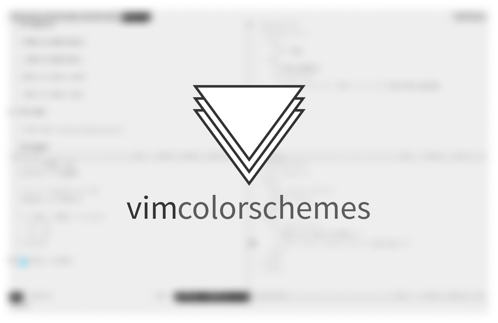

<h1 align="center">
  
</h1>
<h2 align="center" style="border:none">
  Find the best color schemes around for <i>virtually</i> any platform
</h2>

## Welcome 🎉

  
  

[colorschemes.dev](https://colorschemes.dev) solves an old problem of mine, which is to find the perfect color scheme for my IDE. Syntax color in a coding environment is a big part of what makes and IDE yours and yours only.

The project started with vim only but was expanded to any platform.

GitHub is an awesome source for color schemes. There are literally thousands available on the platform. It is not easy to navigate through them, though. Checking out a couple to find a nice one can take a while.

This is where [colorschemes.dev](https://colorschemes.dev) comes in. It creates a **fast** and **fun** gallery to navigate color schemes.

## Active instance(s) of colorschemes.dev

- [vimcolorschemes.com](https://vimcolorschemes.com)

## Key features 🚀

- **Daily updated** list of thousands of color scheme repositories
- **Awesome vim (or arrows) key bindings** to navigate quickly through the whole site

## Get Involved

[colorschemes.dev](https://colorschemes.dev) is aimed to be a collaborative project, and you are invited to help. All types of involvement are welcome!

Developers, check out the [development guide](https://github.com/reobin/colorschemes.dev/wiki/Development-guide) to start writing code.

## Issues

[Bugs and feature requests](https://github.com/reobin/colorschemes.dev/issues) are welcome. Make sure to follow the issue template before posting.

## Credits

Credit goes to all the creators of color schemes around GitHub 🎉
